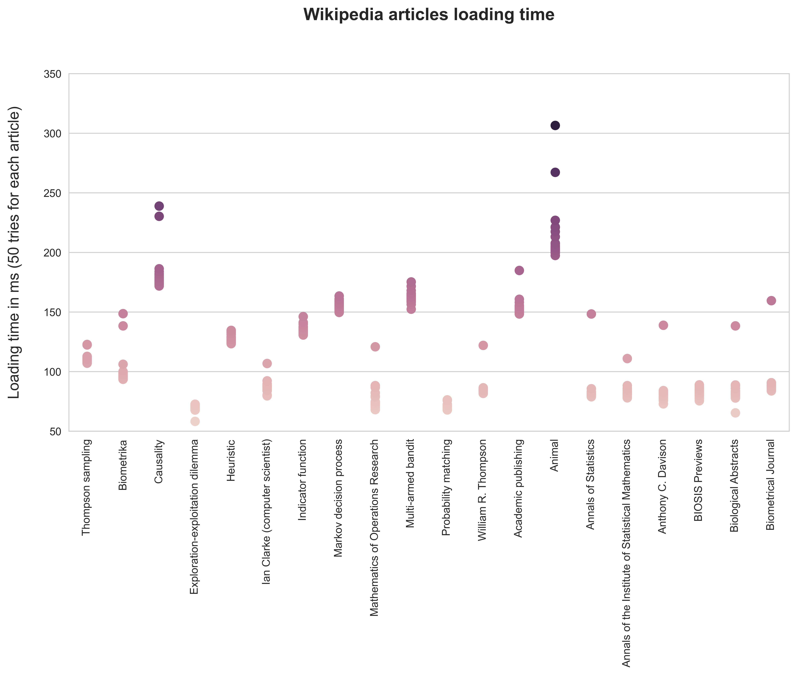

# 🏁 Thompson sampling wikiracing

## 📢  Presentation
This repository proposes several methods for finding the fastest path between two given wikipedia pages (in terms of loading time) using the multi-armed bandits framework. 


## 📝 Modelling the problem :

1) The first step is to model wikipedia articles database as a directed graph where each node is an article. The neighbours of a node are the other Wikipedia pages mentioned in that node in the form of hyperlinks. 

A path is therefore a succession of wikipedia articles where articles with index k are referenced in articles with index k-1 as hyperlinks.

2) We then find the set of paths between the start_node and the end_node of our choice (of length less than an integer k that we have chosen) using the Depth-First-Search algorithm.


3) The search for the shortest path (in terms of loading time) is then modelled as a multi-armed bandits problem. Each of the paths found in step 2 is considered as an arm with a certain loading time distribution. Algorithms traditionally used to solve the MAB problem can then be used in this context.

The aim is then to find the fastest path among all the paths extracted by the DFS while minimising the cumulative loading time. 




The graph above shows the loading times for 10 wikipedia pages (the figure was obtained using the notebook plot_latencies.py).
Page load times can vary greatly depending on the size of the page and the documents it contains (x5-x10 between a short article and very large articles such as "Animal"). This means that the fastest path (in terms of page load time) is not necessarily the one with the fewest articles. Taking a longer route, made up of less popular articles (and therefore with lower loading times), may be a good idea.

It's also worth noting that the loading time for each article varies considerably. This is all the more true for a path made up of several articles. Finding the fastest path while minimising total latency therefore requires appropriate algorithms.

## Drifting reward problem
This repository also allows the integration of an artificial drift of the rewards associated with each arm, in order to model large variations in traffic on article pages, leading to significant changes in loading time. 

This framework is generally referred to as non-stationary bandits. 

For the moment, this repository supports two drift methods:
- linear drift
- brownian drift

## 🛠️ Implemented algorithms : 
Here are the algorithms currently implemented:
- epsilon greedy
- UCB
- Thompson Sampling with Gaussian Prior (when standard deviations of the arms are known)
- Thompson Sampling with Normal Inverse Gamma Prior (when neither means and standard deviations of the arms are known)
- Sliding Window Thompson Sampling (for non-stationary bandits problem)
- Discounted Thompson Sampling (for non-stationary bandits problem)


## ▶️ To run the code
Environment set up: 
```shell
pip install -r requirements.txt
```

To build wikipedia graph:
```shell
python3 build_graph.py
```

To find the shortest path in a graph:
```shell
python3 simulation.py 
```


